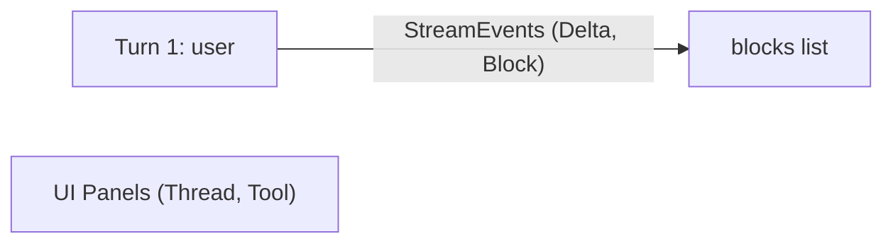
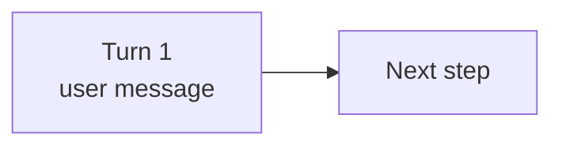
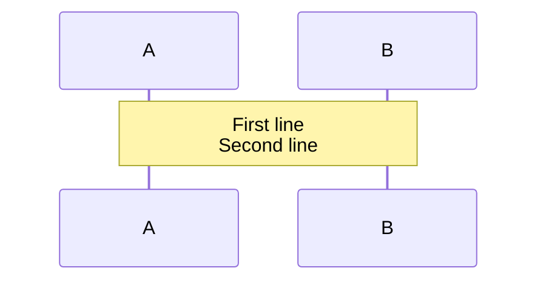
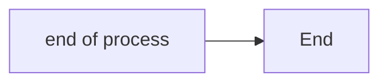

# Mermaid Diagram Rules

After writing or editing any Mermaid block, validate with the co-located script: `scripts/check-mermaid.sh <file>`.

## 1. Quote labels and edges that contain special characters

Any node label with `()`, `[]`, `<>`, `<br/>`, `,`, or emoji must be wrapped in `["..."]`. Same idea for edge labels — use `|"..."|`.

| Context | Needs quotes? | Example |
|---------|--------------|---------|
| Simple text only | No | `A[Hello World]` |
| Contains `()` | **Yes** | `A["Config (optional)"]` |
| Contains `[]` | **Yes** | `A["items list"]` (avoid `[]` entirely) |
| Contains `<br/>` | **Yes** | `A["Line 1<br/>Line 2"]` |
| Contains emoji | **Yes** | `A["Done ✓"]` |
| Contains `"` | **Escape** | `A["Say 'hello'"]` |
| Edge with specials | **Yes** | `A -->\|"data (raw)"\| B` |



## 2. Use `<br/>` for line breaks

Not `\n`. In flowchart labels, quote the label when using `<br/>`.





## 3. The `end` keyword

Lowercase `end` as a node label breaks flowcharts and sequence diagrams. Capitalize it or wrap in quotes:



## 4. Prefer Mermaid themes for general styling

Use built-in themes (`default`, `dark`, `neutral`, `forest`, `base`) rather than styling every node. `classDef` and `style` are fine for intentional emphasis (error paths, highlights), but avoid overriding the theme's defaults — hardcoded fills break in dark mode.

For `rect` grouping in sequence diagrams, use near-transparent fills:

```
rect rgba(128, 128, 128, 0.08)
  Note over A,B: Phase label
end
```

## Edge Cases

- **`o` and `x` after links**: `A---oB` creates a circle-end edge, `A---xB` a cross-end. Add a space if your node ID starts with `o` or `x`: `A--- oNode`.
- **Semicolons in sequence diagrams**: Interpreted as markup. Use `#59;` for literal semicolons.

## Validation

The validation script lives at `scripts/check-mermaid.sh` within this skill directory. It extracts each ` ```mermaid ` block, validates it with `mmdc`, and reports file + line number for failures.

```bash
# Validate specific file
scripts/check-mermaid.sh path/to/file.md

# Validate all .md files recursively from cwd
scripts/check-mermaid.sh

# Validate a directory
scripts/check-mermaid.sh docs/features/
```
