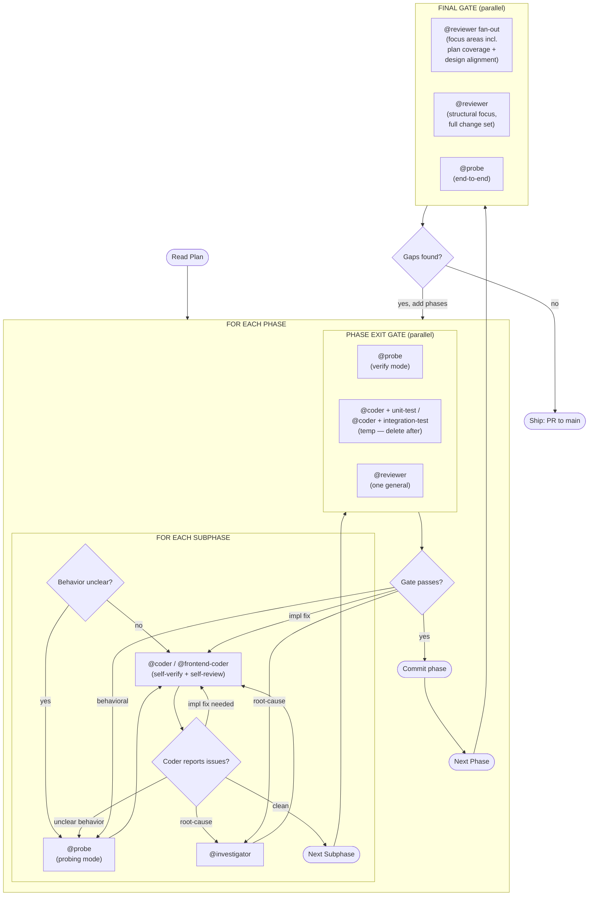

# Execution Model

The plan is executed by @tech-lead as a nested loop: phases outside, subphases inside, with verification at both levels.

## Why Two Levels

- **Coder self-review between subphases** catches drift early while context is still loaded. All coders load `/reflection`.
- **Full gate at phase boundaries** enforces the real quality bar with fresh external perspective before the phase commits. Gate lanes run in parallel (`--bg` + `spawn wait`).
- **Final gate after all phases** proves the whole change set hangs together and matches the design. Discovered gaps feed back as new phases.

## Fix-Cycle Routing

Route findings to the right specialist, not always back to @coder:

- **Implementation bugs** → back to the coder (context is still fresh).
- **Unclear runtime behavior** → `@probe` probe before re-attempting the fix.
- **Root-cause uncertainty** → `@investigator` to diagnose before coding resumes.
- **Phase-gate findings** → route by type as above, then re-run affected gate lanes.
- **Final-gate gaps** → new phase appended to the plan, following the normal phase loop.

## Probe Before Coding

When a subphase depends on runtime behavior that isn't well-understood, spawn
`@probe` in probing mode before coding. Don't let @coder guess at system
behavior — probing is cheap, wrong assumptions are expensive.

## When Subphases Are Omitted

If the phase is small enough that a single coder session can finish it before intermediate verification would help, the phase can be flat — no subphases, just the phase exit gate. The plan should mark these explicitly rather than leaving the reader to infer.
