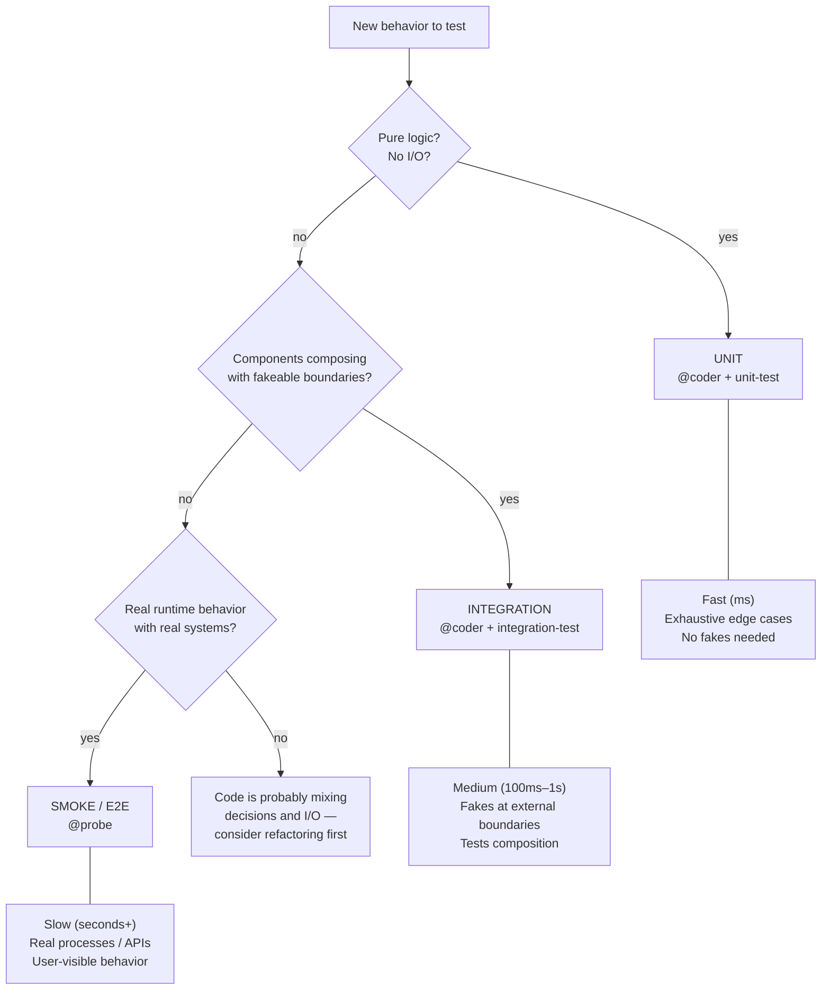

# Tier Judgment

Choosing the right tier is usually the difference between a test that catches real bugs and a test that either misses them or flags noise.

## Decision Diagram

## Tradeoffs by Tier

| Dimension | Unit | Integration | Smoke / E2E |
|---|---|---|---|
| Speed | milliseconds | 100ms – 1s | seconds, sometimes more |
| Fidelity to production | low | medium | high |
| Isolation on failure | sharp | medium | diffuse |
| Cost to write | low | medium | high |
| Cost to maintain | low if targeting behavior | medium | high |
| Answers question | "does the logic hold?" | "do pieces compose?" | "does it work for a user?" |

## Heuristics

- **Default to the lowest tier that answers the question.** Lower tiers are faster feedback and sharper failure signals.
- **Move up a tier when the question is about collaboration or integration.** Unit tests cannot answer "do these modules agree on the contract."
- **Move up a tier when mocking starts dominating.** A unit test with five mocks is usually an integration test wearing a disguise.
- **Don't duplicate coverage across tiers.** If the smoke test proves a code path works, a unit test that reasserts the same thing adds maintenance without protection.
- **Critical paths deserve redundancy.** Authentication, billing, data loss risks — test at multiple tiers because the cost of a false negative is high.

## Common Sizing Mistakes

- **Unit tests that mock everything** — should probably be integration tests, or the code should be refactored to have a testable core.
- **Integration tests that spin up real databases** — probably should be smoke tests, or the database client should be wrapped in a fake-able interface.
- **Smoke tests that verify string formatting** — should be unit tests. Smoke tests are expensive; reserve them for behavior only visible end-to-end.
